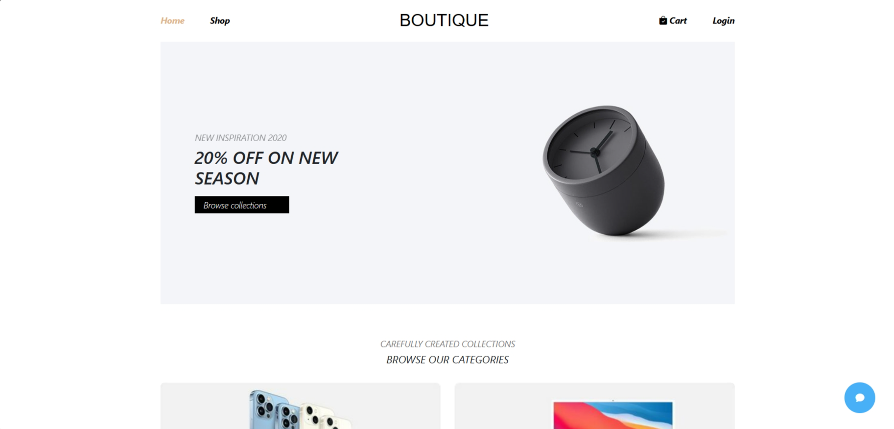

# [BOUTIQUE APPLE](https://rjs-asm03-nguyenhhkiet.vercel.app/)



## Introduction

Experience unlimited phone shopping at [BOUTIQUE APPLE](https://rjs-asm03-nguyenhhkiet.vercel.app/). With a variety of designs, quality, and value, we offer you a convenient and reliable online shopping space. Explore the world of smart technology today!

### Project Description

-   **Layout Creation:** Includes NavBar and Footer
-   **Categories:** List of product categories
-   **Products:** List of products
-   **Product Details:** Display detailed product information in a popup
-   **Product List View:** Create an interface for listing products
-   **Product Detail View:** Create an interface to view product details
-   **Account Management:** Handle account login/registration
-   **Cart Management:** Add products to the cart
-   **Cart View:** Create an interface to view the cart
-   **Checkout:** Create a checkout interface
-   **Live Chat:** Create a live chat screen

### Requirements

1. **Create a New ReactJS Project:**
   Initialize a new project with:

    ```bash
    npx create-react-app rjs-asm03
    ```

2. **Set Up Router:**
   Install `react-router-dom` and configure routes:

    - HomePage: `/`
    - ShopPage: `/shop`
    - DetailPage: `/detail/<productId>`
    - CartPage: `/cart`
    - CheckoutPage: `/checkout`
    - LoginPage: `/login`
    - RegisterPage: `/register`

3. **Create Layout:**

    - **NavBar:** Includes links to HomePage, ShopPage, LoginPage, and CartPage.
    - **Footer:** Three columns with dummy links (using Bootstrap 5).

4. **Home Page:**

    - **Banner:** Features a "Browse collections" button.
    - **Categories:** Hover effect and redirection to ShopPage.
    - **Products:** Display up to 8 products, format price, and use `img1` for images.
    - **Additional Info:** Use Bootstrap for layout.

5. **Product Popup:**

    - Create `Popup` component with Redux actions `SHOW_POPUP` and `HIDE_POPUP`.

6. **Shop Page:**

    - Display products based on categories with a `ProductList` component.
    - Enable product search and redirection to Detail Page.

7. **Detail Page:**

    - Show detailed product information and related products.

8. **Account Management:**

    - **Sign Up:** Validate and store user data in `localStorage`.
    - **Sign In:** Validate login credentials and manage session with Redux.
    - **Logout:** Clear user session and update `localStorage`.

9. **Cart Management:**

    - Manage cart items with Redux actions `ADD_CART`, `UPDATE_CART`, `DELETE_CART`.
    - Persist cart data in `localStorage`.

10. **Cart Page:**

    - Display cart items, total price, and provide options to continue shopping or proceed to checkout.

11. **Checkout Page:**

    - Form for entering shipping and payment information; display order summary.

12. **Live Chat (Optional):**
    - Floating chat interface with toggle functionality.

## Tech Stack

-   ReactJS
-   React-Redux
-   React-Router-Dom
-   Bootstrap
-   Prettier, ESLint, and Husky

### Setup Prettier, ESLint, and Husky for code quality

-   Installed and configured Prettier for code formatting
-   Installed and configured ESLint for code linting
-   Set up Husky with pre-commit hooks to enforce linting and formatting
-   Added lint-staged to run Prettier and ESLint on staged files before commits

## Features

👉 **Home Page:** Dynamic home page showcasing featured products.

👉 **Detail Page:** Display detailed information about products.

👉 **Cart Page:** Update the user's shopping cart when adding products, displaying essential information about prices and quantities in the cart.

👉 **SignUp/SignIn Page:** Seamless and secure registration and login functionalities.

👉 **Responsive:** Fully responsive design across devices; fluid design adapts seamlessly to various screen sizes, ensuring accessibility.

## Quick Start

Follow these steps to set up the project locally on your machine.

**Prerequisites**

Ensure you have the following installed on your machine:

-   Git
-   Node.js
-   npm (Node Package Manager)

**Installation**

Install the project dependencies using npm:

```bash
npm install
```

**Running the Project**

```bash
npm run start
```
